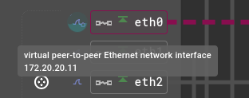
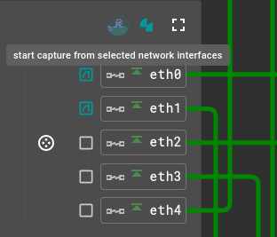

# README

## Démarrage du lab

```
containerlab deploy; docker exec -it srte-lab-odl-frr-pce bash -c "sh /tmp/setup.sh"
```

## Activation de MPLS sur la VM

```
sudo nano /etc/modules-load.d/mpls.conf
```

Y écrire :

```
mpls_router
mpls_iptunnel
```

Activer les modules :

```
sudo modprobe mpls_router
sudo modprobe mpls_iptunnel
```

---

```
sudo nano /etc/sysctl.d/99-mpls.conf
```

Y écrire :

```
net.mpls.platform_labels=1000
```

Appliquer la configuration :

```
sudo sysctl -p /etc/sysctl.d/99-mpls.conf
```

## Quelques commandes

### OpenDaylight

Client Karaf : `docker exec -it pcep-lab-srte-pce bin/client`

#### Requête

```
curl -u admin:admin -X PUT \
     -H "Content-Type: application/json" \
     -d @<fichier>.json \
     "http://172.20.20.10:8181/<url>"
```

```
http://172.20.20.10:8181/rests/data/network-topology:network-topology/topology=pcep-topology
http://172.20.20.10:8181/rests/data/openconfig-network-instance:network-instances/network-instance=global-bgp
http://172.20.20.10:8181/rests/data/bgp-rib:bgp-rib/rib=bgp-odl/loc-rib
```

### FRR

`docker exec -it pcep-lab-srte-router<i> vtysh`

- Mode configuration : `configure terminal`
- Afficher la table MPLS : `show mpls table`
- Afficher les policy : `show sr-te policy detail`

#### Ajouter une policy

```
configure terminal
  segment-routing
    traffic-engineering
      policy color <num> endpoint <A:B:C:D>
        ! Définition d'un chemin candidat
        candidate-path preference <num> name <NAME> dynamic
        candidate-path preference <num> name <NAME> explicit segment-list <NAME>

      ! Définition d'une liste de segments
      segment-list <NAME>
```

Exemple :

```
candidate-path preference 100 name CP1 dynamic
candidate-path preference 200 name CP2 explicit segment-list mylist
```

Ajout de la route :

```
ip route <network> <endpoint (de la policy)> color <num>
ip route 192.168.40.2/32 10.0.0.4 color 100
```

Vérification :

```
docker exec -it pcep-lab-srte-router<i> bash
ip -f mpls route
ip route
```

#### Exemple de liste

```
! Selon les labels de la SRGB (Global Block)
segment-list mylist
    index 2 mpls label 16002
    index 3 mpls label 16003
    index 4 mpls label 16004

! Adjacency SID + Prefix SID
segment-list nai_list
    index 2 nai adjacency 192.168.12.1 192.168.12.2
    index 3 nai adjacency 192.168.23.1 192.168.23.2
    index 4 nai prefix 10.0.0.4/32 algorithm 0
```

## Edgeshark + Wireshark

Edgeshark permet de voir la topologie du réseau de conteneurs, mais aussi de lancer des captures Wireshark directement via une interface web.

### Installation et mise en place

[Intégration Edgeshark Containerlab](https://containerlab.dev/manual/wireshark/#edgeshark-integration)

Docker compose service Edgeshark :

```
curl -sL \
https://github.com/siemens/edgeshark/raw/main/deployments/wget/docker-compose.yaml \
| DOCKER_DEFAULT_PLATFORM= docker compose -f - up -d
```

Capture Wireshark via Edgeshark :

- https://edgeshark.siemens.io/#/getting-started?id=optional-capture-plugin
- https://github.com/siemens/cshargextcap/releases/tag/v0.10.7

```
sudo dnf install ./cshargextcap_0.10.7_linux_amd64.rpm
sudo gpasswd -a $USER wireshark
```

Capture d'une seule interface :



Capture de plusieurs interfaces :



## Docs + liens utiles

### OpenDaylight

- https://docs.opendaylight.org/en/stable-titanium/
- https://docs.opendaylight.org/projects/bgpcep/en/latest/index.html

### FRR

- https://containerlab.dev/lab-examples/frr01/
- https://github.com/srl-labs/containerlab/blob/main/lab-examples/frr01/router1/frr.conf
- https://github.com/FRRouting/frr
- https://docs.frrouting.org/en/latest/
- https://frrouting.org/release/
- https://quay.io/repository/frrouting/frr?tab=tags

